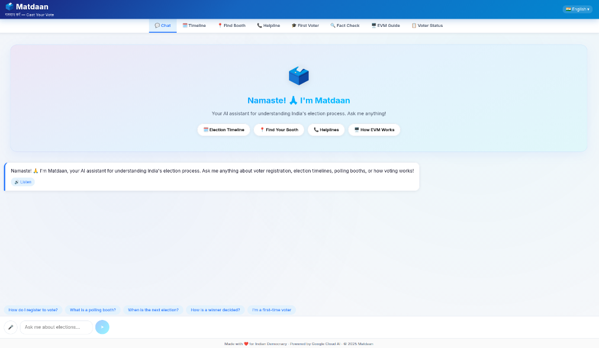
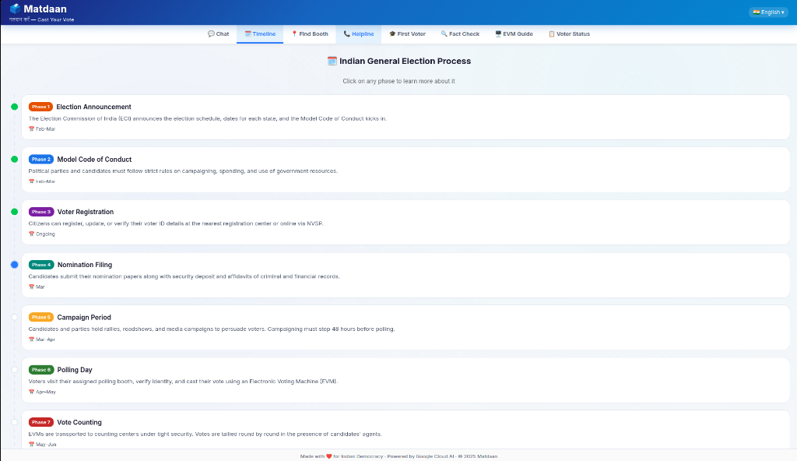
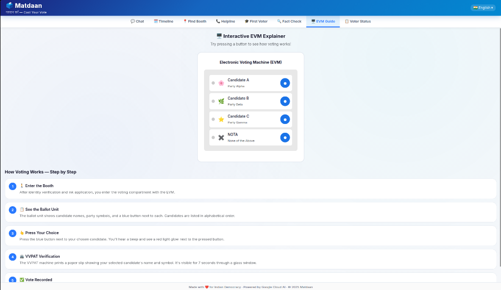

# 🗳️ Matdaan — AI-Powered Election Assistant

> **Matdaan** (Hindi: मतदान — "casting a vote") is an interactive, multilingual AI assistant designed to help Indian citizens navigate the election process. From understanding voter registration to finding the nearest polling booth, Matdaan simplifies democracy.


---

## ✨ Features

- 💬 **AI Chat Assistant** — Ask anything about Indian elections. Powered by Gemini 1.5 Flash for fast, accurate, and neutral responses.
- 🌐 **11 Indian Languages** — Full platform localization in English, Hindi, Bengali, Telugu, Marathi, Tamil, Gujarati, Punjabi, Kannada, Malayalam, and Odia.
- 🗓️ **Election Timeline** — Interactive 8-phase visual timeline explaining the entire election process from announcement to result declaration.
- 📍 **Polling Booth Finder** — Find your nearest polling booth using your location and Google Maps integration.
- 🖥️ **Interactive EVM Explainer** — Step-by-step visual guide on how Electronic Voting Machines and VVPAT systems work.
- 🎓 **First-Time Voter Guide** — A curated checklist to get 18-year-old citizens ready for their first vote.
- 🔊 **Voice Interactions** — Talk to Matdaan using browser-native Speech-to-Text and listen to answers via Text-to-Speech.

---

## 📸 Screenshots

### AI Chat Assistant (Multilingual)


### Interactive Election Timeline


### EVM Explainer


---

## 🚀 How to Run Locally

Follow these steps to clone the repository and run Matdaan on your local machine.

### Prerequisites
- Node.js 20+
- npm 10+
- A Google Gemini API Key (Get one free from [Google AI Studio](https://aistudio.google.com/))

### 1. Clone the repository
```bash
git clone https://github.com/your-username/matdaan.git
cd matdaan
```

### 2. Set up Environment Variables
Create a `.env` file in the `backend/` directory:
```bash
# backend/.env
GEMINI_API_KEY=your_gemini_api_key_here
```

*(Optional)* Create a `.env` file in the `frontend/` directory for Maps:
```bash
# frontend/.env
VITE_MAPS_API_KEY=your_google_maps_api_key
```

### 3. Run the Backend
```bash
cd backend
npm install
npm run dev
```
The backend will start on `http://localhost:8080`.

### 4. Run the Frontend
Open a new terminal window:
```bash
cd frontend
npm install
npm run dev
```
The frontend will start on `http://localhost:3000`. Open this URL in your browser to start using Matdaan!

---

## 🐳 Docker Setup (Alternative)

If you prefer using Docker, you can spin up both the frontend and backend with a single command:

```bash
docker-compose up --build
```

- Frontend → `http://localhost:3000`
- Backend → `http://localhost:8080`

---

## 📄 License

This project is licensed under the Apache License 2.0 — see the [LICENSE](LICENSE) file for details.

<p align="center">Built with ❤️ for Indian Democracy</p>
